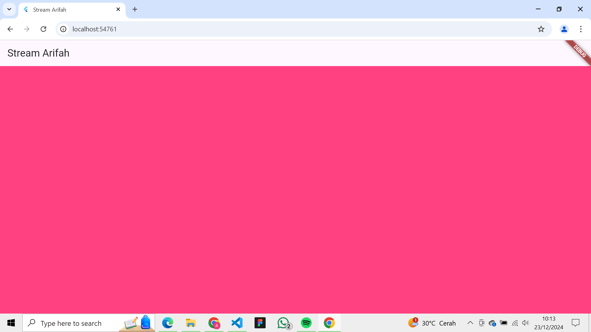
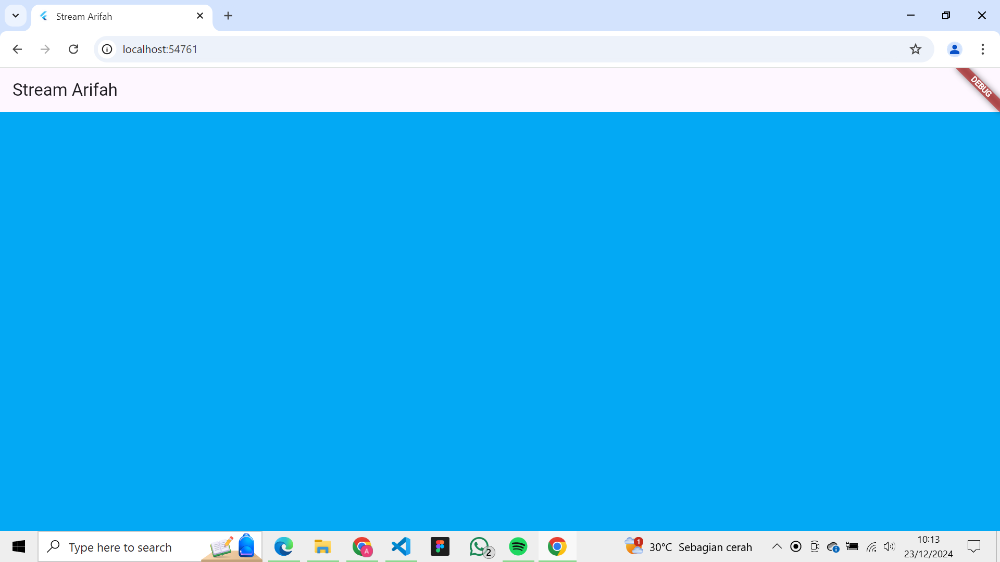

Nama : Arifah Nur Basyiroh Machi
NIM : 362358302018
Kelas : 2B TRPL

SOAL 3
1. Jelaskan fungsi keyword yield*!
Jawab :
Keyword yield* digunakan dalam fungsi generator (async* atau sync*) untuk meneruskan seluruh elemen dari stream atau iterable lain ke dalam stream yang dihasilkan. Ini seperti "memasukkan" elemen-elemen dari sumber lain tanpa perlu menulis yield satu per satu.

2. Apa maksud isi perintah kode tersebut?
Jawab :
Kode tersebut membuat fungsi getColors yang menghasilkan stream (Stream<Color>) dari elemen-elemen dalam daftar colors. Setiap 1 detik, fungsi ini memancarkan elemen berikutnya dari daftar secara bergiliran, dan kembali ke awal jika sudah mencapai akhir.

SOAL 4

